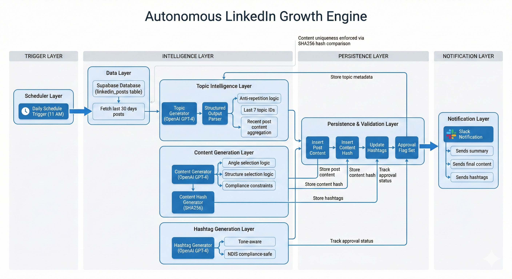

# Autonomous LinkedIn Growth Engine: Multi-Agent AI Content Production

## Overview

This workflow is a sophisticated **multi-agent AI pipeline** designed to autonomously generate high-compliance, professional LinkedIn content for the disability support sector.

It leverages specific regulatory knowledge (NDIS), enforces strictly conservative "compliance-first" framing, and produces content that is safe for professional networks without human intervention.

## Business Problem

**Consistency vs. Compliance:**
Maintaining a consistent social media presence in highly regulated sectors is difficult because:
- Generic AI tools produce hallucinated or non-compliant claims.
- Human review is time-consuming and expensive.
- Content must strictly adhere to specific service groups and language models.

The goal was to build an engine that could "think like a compliance officer" while writing like a professional.

---

## System Architecture

The system uses a **Sequential Agentic Chain** where each AI agent has a distinct, narrow responsibility.

1.  **Schedule Trigger:** Runs daily at 11:00 AM.
2.  **Context Retrieval:** Fetches the last 30 days of posts from **Supabase** to prevent topic repetition.
3.  **Agent 1: Topic Generator:**
    - Analyzes past topics.
    - Selects an under-served "service group" (e.g., Community Nursing, Shared Living).
    - Proposes a unique, sterile topic idea.
4.  **Agent 2: Content Generator:**
    - Receives the approved topic.
    - Writes the post body using a "Safety-First" prompt that forbids promotional language.
    - Checks past post structures to ensure variety in writing style.
5.  **Agent 3: Hashtag Generator:**
    - Generates 4-6 professional hashtags based on the specific content tone.
6.  **Database Commit:**
    - All steps are logged to Supabase for audit trails.
    - A cryptographic hash (SHA-256) of the content is stored to detect duplicates in future runs.
7.  **Notification:**
    - The final post is sent to **Slack** for visibility (or direct publishing).

---

## Workflow Logic

### The "Safety-First" Prompting Strategy

Unlike standard marketing flows, this engine uses **negative constraints** as its primary logic driver.

**Example Constraint in Topic Agent:**
> "Do NOT produce topics that promise outcomes or results. Do NOT use promotional language. Topics must be written for support coordinators, NOT participants."

**Example Constraint in Content Agent:**
> "Allowed verbs only: support, assist, provide, coordinate. Do NOT use: treat, fix, cure, improve, best, leading."

### Data Persistence (Supabase)

The system maintains a "memory" of its own work:

-   `topic_id`: Unique slug for every idea to prevent reuse.
-   `content_hash`: Ensures even if the AI generates similar text, it can be mathematically flagged.
-   `node_stage`: Tracks where a post is in the pipeline (topic_generated -> post_created -> hashtags_created).

---

## Failure Handling & Guardrails

-   **Duplicate Prevention:** The workflow checks the last 30 days of database entries before generating a new topic.
-   **Hallucination Control:** Agents are strictly scoped to 8 specific NDIS service groups. If a generated topic falls outside these groups, the prompt logic forces a retry or conservative fallback.
-   **Tone Enforcement:** The `tone` parameters (informational | process | workforce | coordination) are passed explicitly between agents to ensure the headline matches the body copy.

---

## Results & Impact

-   **Zero-Touch Operation:** Generates 100% safely framed content daily.
-   **Regulatory Safety:** Eliminates the risk of "over-promising" which is a major liability in healthcare marketing.
-   **Variety:** The architecture ensures that even with a limited set of services, the content angles (Risk, Ops, Documentation, Handover) are rotated systematically.

---

## Why n8n?

n8n is the only platform that allows for:
-   **LangChain Integration:** Seamlessly switching between OpenAI agents and structured data tools.
-   **Memory Management:** Passing complex JSON objects (Topic + History + Constraints) between autonomous steps.
-   **Database Operations:** Reading/Writing history to Supabase in the middle of an AI chain.
