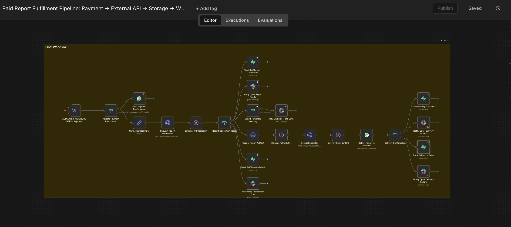

# Paid Report Fulfillment Pipeline: Payment → External API → Storage → WhatsApp

## Overview

This workflow implements a production-grade fulfillment pipeline for delivering paid digital reports.

It is triggered after a successful payment and orchestrates input normalization, external report generation, artifact storage, customer delivery, and operational visibility with explicit success and failure handling.

The system is designed to be resilient to third-party failures and transparent to operations teams.

---

## Business Problem

Delivering paid digital reports manually or through loosely connected scripts leads to:

- Delayed fulfillment
- Silent failures from external APIs
- Poor visibility into delivery status
- High operational overhead when issues occur

A reliable, observable fulfillment system was required to ensure customers receive their reports consistently while keeping operations informed of failures.

---

## System Architecture

The fulfillment process is orchestrated as a single pipeline with clear responsibility boundaries:

- Event-driven trigger
- Controlled interaction with external dependencies
- Persistent storage of generated artifacts
- Explicit delivery confirmation
- Centralized fulfillment status tracking
- Real-time ops visibility

---

## Workflow Logic

High-level flow:

1. **Payment success trigger**  
   The workflow starts only after a confirmed payment event.

2. **Input normalization**  
   User-provided data such as date, time, and language preferences are normalized to ensure compatibility with downstream systems.

3. **External report generation**  
   A third-party report service is invoked to generate the digital report.

4. **Dependency guard**  
   Credit availability and rate limits are evaluated before proceeding further.

5. **Report artifact generation**  
   The generated report is converted into a downloadable document format.

6. **Persistent storage**  
   The report file is stored in object storage for durability and controlled access.

7. **Customer delivery**  
   The report is delivered to the customer via WhatsApp.

8. **Fulfillment tracking**  
   Delivery status and metadata are recorded for auditability and reconciliation.

9. **Ops visibility**  
   Any failure or exceptional condition triggers immediate Slack notifications to the ops team.

### n8n Workflow View

---

## Failure Handling & Reliability

Failures are treated as expected scenarios, not exceptions:

- External API unavailability or quota exhaustion
- Document generation issues
- Message delivery failures
- Partial execution states

Handling includes:
- Guard clauses before expensive operations
- Explicit branching for success and failure
- Persistent tracking of fulfillment states
- Slack alerts for real-time operational awareness

This prevents silent failures and enables fast manual intervention when needed.
This workflow is designed to be idempotent.
Reprocessing the same payment event does not result in duplicate report delivery.

---

## Data Handling

The workflow processes structured user input and generated report artifacts.

- Input data is normalized before external use
- Generated files are stored durably
- Fulfillment metadata is persisted for traceability

No unnecessary personal data is retained beyond fulfillment requirements.

---

## Security & Privacy Notes

- All API credentials are excluded from this repository
- Export credentials are placeholders only
- Client identifiers, phone numbers, and personal details are masked
- External service access is handled server-side only

The workflow cannot be executed without configuring valid credentials.

---

## Results & Impact

- Automated end-to-end report fulfillment
- Reduced delivery time from hours to minutes
- Clear visibility into fulfillment success and failure
- Lower operational load due to proactive alerts

This pipeline enables reliable delivery of paid digital products at scale.

---

## Why n8n

n8n enables this system by:

- Acting as a central orchestration layer
- Supporting complex branching and waits
- Integrating APIs, storage, and messaging in one workflow
- Making execution paths debuggable and observable

---

## What’s Not Included

- Payment initiation logic
- Frontend checkout implementation
- Retry backoff tuning for external APIs
- Customer-facing dashboards

These are intentionally excluded to keep the focus on fulfillment orchestration.
