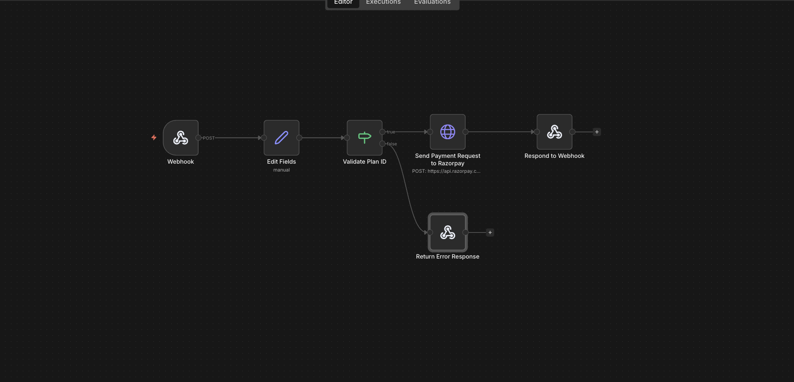

# Create Payment Order API: Frontend → n8n → Razorpay

## Overview

This workflow exposes a lightweight backend API for creating Razorpay payment orders.

A frontend or client application calls an n8n webhook endpoint with a selected plan, and the workflow validates input, maps pricing, creates a Razorpay order, and returns the response synchronously.

---

## Business Problem

Frontend applications often need a secure backend layer to create payment orders without exposing Razorpay credentials.

Hardcoding pricing or calling Razorpay directly from the frontend introduces security risks and makes pricing logic difficult to manage or change.

---

## System Architecture

The workflow acts as a thin backend API layer between the frontend and Razorpay.

---

## Workflow Logic

High-level flow:

1. **Webhook trigger**  
   Receives a POST request from the frontend containing a selected plan ID.

2. **Plan validation & pricing logic**  
   Maps the plan ID to a predefined amount in paise.
   Invalid or unknown plans are rejected early.

3. **Conditional routing**  
   - Valid plan → proceed to Razorpay
   - Invalid plan → return error response

4. **Razorpay order creation**  
   Calls Razorpay’s Orders API using secure server-side authentication.

5. **Synchronous response**  
   Returns the Razorpay order payload back to the caller for frontend checkout.

### n8n Workflow View

---

## Failure Handling & Validation

The workflow includes explicit guards:

- Plan ID validation before external API calls
- Early rejection for invalid input
- Controlled response payloads
- No partial execution paths

This keeps the API predictable and safe for frontend consumption.

---

## Security & Privacy Notes

- Razorpay credentials are never exposed to the frontend
- All API calls to Razorpay happen server-side
- Export credentials are placeholders only
- No client identifiers or secrets are included in this repository

---

## Results & Impact

- Frontend remains stateless and secure
- Pricing logic centralized in one place
- Razorpay credentials fully protected
- Faster iteration on plans and pricing

This workflow acts as a clean payment gateway interface for client applications.

---

## Why n8n

n8n works well here because:

- It can act as a secure webhook-based backend
- Business logic and validation remain visible and editable
- External API calls are easy to control and debug
- Responses can be returned synchronously without extra services

---

## What’s Not Included

- Frontend checkout implementation
- Razorpay webhook handling (covered in a separate case study)
- Signature verification middleware
- Rate limiting or auth layers

These are intentionally excluded to keep the focus on order creation logic.