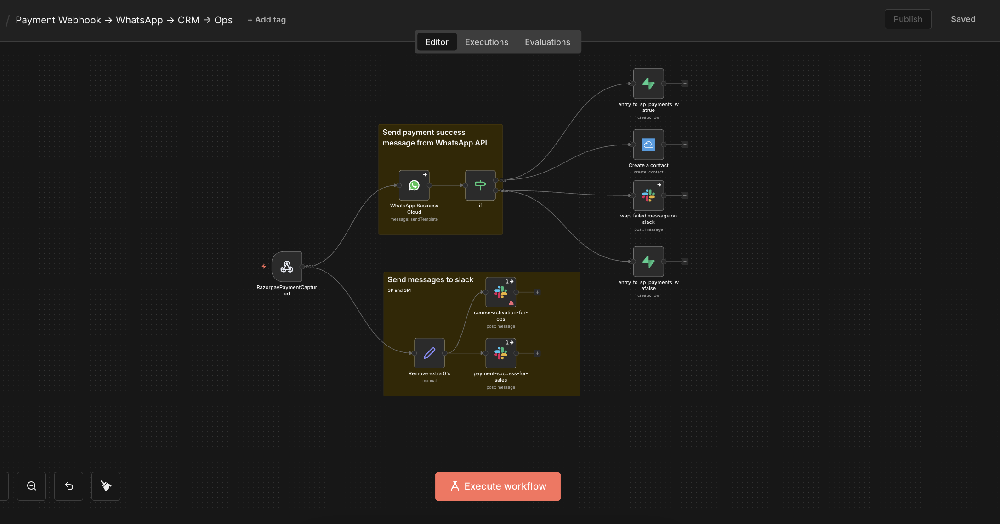

# Payment Webhook Automation: Razorpay → WhatsApp → CRM → Ops

## Overview

This workflow automates post-payment operations using an event-driven approach.  
Razorpay sends payment events directly to an n8n webhook endpoint, which orchestrates customer communication, internal notifications, and data persistence.

The workflow is designed for production use, with explicit branching, failure handling, and logging to avoid manual intervention.

---

## Business Problem

Payments were being received successfully, but post-payment actions were fragmented and manual.

Customer confirmations were delayed, internal teams lacked real-time visibility, and payment data was not consistently recorded across systems.  
Failures in downstream communication often went unnoticed, creating operational gaps and follow-up issues.

---

## System Architecture

Razorpay sends payment events directly to an n8n webhook configured in the Razorpay dashboard.  
The n8n workflow acts as the primary event consumer and coordinates all downstream actions.

---

## Workflow Logic

High-level flow:

1. **Webhook trigger**  
   Receives a payment captured event from Razorpay.

2. **Data normalization**  
   Normalizes payment amount and core fields for downstream systems.

3. **Customer notification**  
   Sends a WhatsApp template message to the customer.

4. **Conditional branching**  
   Evaluates WhatsApp message delivery status.

5. **Success path**
   - Creates or updates the contact in the CRM
   - Persists payment and delivery status in the database
   - Sends internal success notifications

6. **Failure path**
   - Logs the failure state
   - Sends an alert to the ops team for manual follow-up

### n8n Workflow View

---

## Failure Handling & Observability

Failure scenarios are treated as first-class cases:

- WhatsApp API rejection or delivery failure
- Partial downstream execution
- Third-party API instability

Handling includes:
- Explicit conditional branching
- Separate logging for success and failure paths
- Slack alerts for operational visibility
- Workflow-level error handling enabled

This prevents silent failures and reduces dependency on manual monitoring.

---

## Data Persistence

Payment outcomes are persisted with minimal but sufficient data:

- Payment ID
- Customer contact details
- WhatsApp delivery status

This enables auditability, reconciliation, and safe reprocessing if required.

---

## Security & Privacy Notes

- No real credentials are included in this repository
- Export credentials are placeholders only
- Client identifiers, phone numbers, and account details are masked
- The workflow cannot execute without configuring fresh credentials

Webhook signature verification is assumed to be handled upstream.

---

## Results & Impact

- Manual post-payment work eliminated
- Customer confirmations sent in near real time
- Internal teams receive instant visibility
- Failed communications surfaced immediately

This reduced operational overhead and improved payment follow-through.

---

## Why n8n

n8n was chosen due to:

- Native webhook handling
- Clear branching and conditional logic
- Execution-level visibility for debugging
- Flexibility to integrate multiple APIs in a single workflow
- Suitability for self-hosted, cost-controlled setups

---

## What’s Not Included

- Real API keys or OAuth tokens
- Client-specific identifiers
- Infrastructure setup (hosting, reverse proxy, signature validation)
- UI or frontend components

These are intentionally excluded for security and scope clarity.
