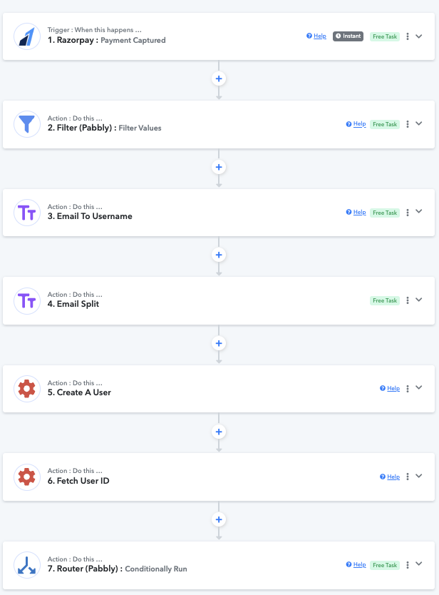
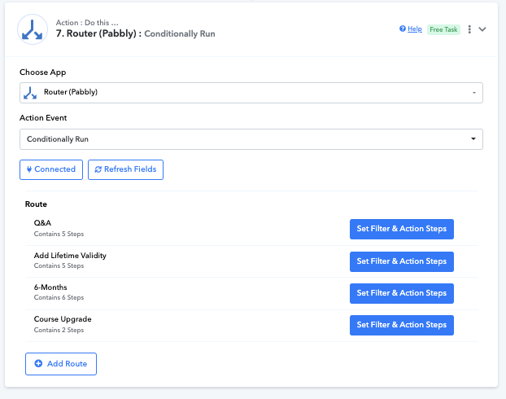
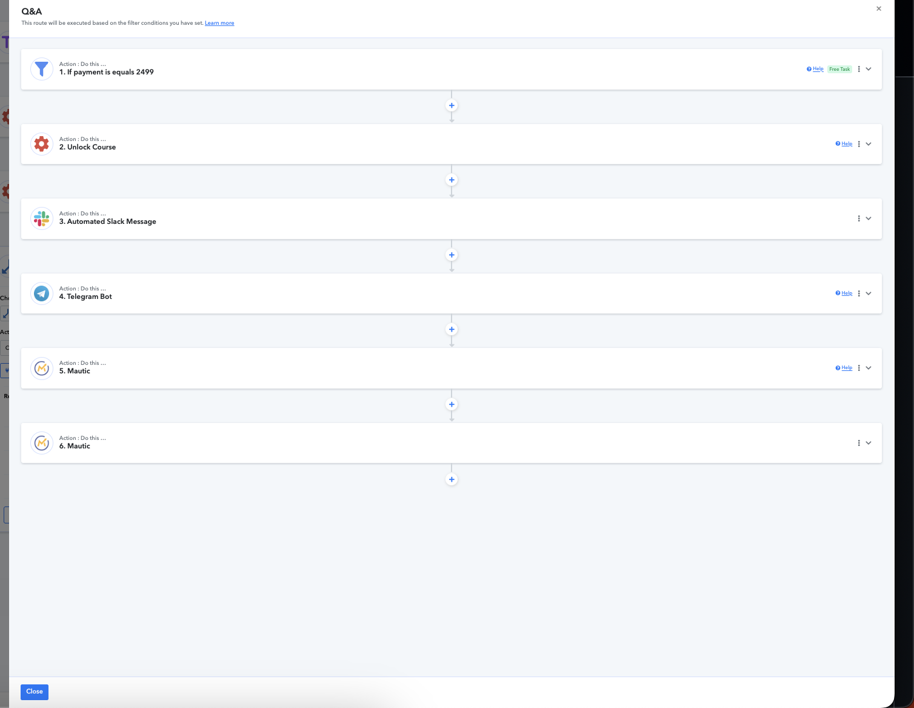
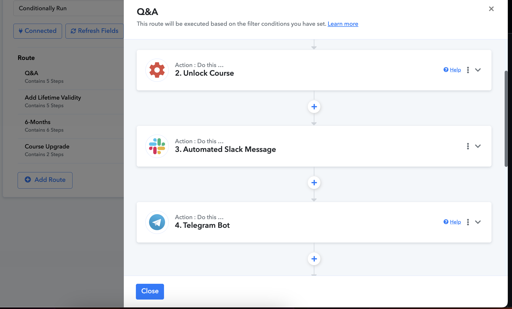

# SFAIAHM Course Unlock Automation  
**Razorpay → Moodle | Payment-Based Course Fulfilment**

## Overview

This workflow automates course access for the **SFAIAHM** course based on successful **Razorpay payment capture events**.

It was originally built in **Pabbly Connect** and is now being documented for **migration to n8n**.

The automation removes manual intervention from payment verification, user creation, course enrolment, and internal notifications.

---

## High-Level Architecture

The system is built around a single event-driven pipeline:
- Razorpay acts as the source of truth for payments
- A central automation workflow orchestrates validation, enrolment, and notifications
- Moodle handles access control via enrolment validity
- Internal tools (Slack, Telegram, CRM) provide visibility and follow-up

---

## What This Workflow Does

1. Listens for a **Razorpay `payment.captured` webhook**
2. Validates the payment amount against predefined plans
3. Normalizes user data (email, username)
4. Creates or updates the user in **Moodle**
5. Enrols the user into a **single course** with plan-based validity rules
6. Sends internal notifications (**Slack + Telegram**)
7. Syncs the user to CRM segments (**Mautic**, legacy)

---

## Trigger

**Payment Provider:** Razorpay  
**Event:** `payment.captured`

### Data Used
- `email`
- `phone`
- `amount` (paise)
- `created_at`

No additional metadata, signature validation, or replay protection is implemented.

---

## Workflow Overview (Pabbly Connect)

The workflow is implemented as a single pipeline with a central router that branches based on payment amount.  
All plan logic converges back into shared notification and CRM steps.

---

## Amount-Based Plan Validation

All routing logic is driven purely by the payment amount (in paise).

| Plan        | Amount (₹) | Amount (paise) |
|-------------|-----------:|---------------:|
| Q&A         | 2499       | 249900         |
| Lifetime    | 999        | 99900          |
| 6 Months    | 499        | 49900          |
| Upgrade     | 500        | 50000          |

If the payment amount does **not** match any of the above, the workflow stops.

Currency is assumed to be **INR**.

---

## Plan Routing Logic

The router evaluates the payment amount and routes execution to the corresponding plan logic.  
No fallback or partial matches are allowed.

---

## Shared Pre-Processing

### Email Normalization
- Email is converted to lowercase

### Username Generation
- Username is derived from the email (substring before `@`)
- Assumed to be unique
- No duplicate handling or conflict resolution

---

## Moodle Course Model

| Attribute        | Value |
|------------------|-------|
| Course Count     | 1 |
| Course ID        | 2 |
| Role ID          | 5 (Student) |
| Differentiation  | Enrolment validity only |

All plans enrol users into the **same Moodle course**.

---

## Moodle Enrolment Logic

Enrolment behavior differs only by **validity period**, not by course or role.

---

## Plan-Specific Enrolment Logic

### 1. Q&A Plan (₹2499)
- Condition: `amount == 249900`
- Enrol into course `2`
- No expiry

---

### 2. Lifetime Plan (₹999)
- Condition: `amount == 99900`
- Enrol into course `2`
- No `timeend` (lifetime access)

---

### 3. 6-Month Plan (₹499)

**Step 1: Calculate Expiry**
- Base time: `payment.created_at`
- Operation: `+6 months`
- Tool: Pabbly DateTime Formatter

**Step 2: Enrol With Expiry**
- `timestart` = payment timestamp
- `timeend` = calculated expiry

---

### 4. Upgrade Plan (₹500)
- Condition: `amount == 50000`
- Enrol into course `2`
- Treated as a special payment case for the same course

---

## Notifications

### Slack (Primary Ops Monitoring)

- Single-user workspace
- Includes payment details, user info, and plan context
- Used for manual monitoring and intervention

---

### Telegram (Fallback)

- Bot DM to self
- Used in case Slack notifications are missed

---

## CRM Sync (Mautic – Legacy)

Mautic is no longer actively used but is documented for completeness.

### Steps
1. Create or update contact (keyed by email)
2. Add to segment based on plan

| Segment ID | Meaning |
|-----------:|--------|
| 101 | SFAIAHM – Lifetime |
| 102 | SFAIAHM – 6 Months |
| 103 | SFAIAHM – Upgrade |
| 104 | SFAIAHM – Q&A |

---

## Error Handling

- No automated retries
- No rollback logic
- No idempotency protection
- Failures are handled manually via Slack / Telegram alerts

---

## Explicit Non-Goals

This workflow intentionally does **not** handle:

- Refund-based unenrolment
- Duplicate webhook events
- Moodle user conflicts
- Security hardening
- Credential abstraction
- Long-term maintainability improvements

---

## Migration Notes (Pabbly → n8n)

This workflow is fully portable:

| Pabbly | n8n Equivalent |
|------|----------------|
| Router | IF nodes |
| DateTime Formatter | Date & Time node |
| API calls | HTTP Request |
| Slack / Telegram | Native n8n nodes |

A functionally equivalent **n8n implementation** will be created separately.