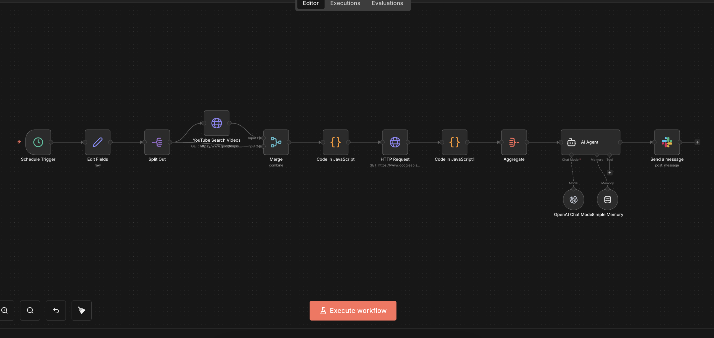

# Content Opportunity Analysis: YouTube → Data Scoring → AI Summary → Slack

## Overview

This workflow automates the discovery and evaluation of content opportunities using recent YouTube data.

It combines deterministic data processing with controlled AI analysis to identify high-performing topics and deliver concise, actionable summaries to Slack on a scheduled basis.

---

## Business Problem

Content teams often rely on intuition or manual research to decide what topics to create content around.

This approach is time-consuming, inconsistent, and makes it difficult to identify emerging opportunities early, especially across competitive or fast-moving niches.

---

## System Architecture

The workflow runs on a schedule and orchestrates data collection, scoring, AI analysis, and delivery in a single pipeline.

---

## Workflow Logic

High-level flow:

1. **Scheduled trigger**  
   Runs the workflow at a fixed daily time.

2. **Seed topic generation**  
   Defines a list of seed topics to explore.

3. **YouTube data collection**  
   - Searches for recently published videos per topic  
   - Fetches detailed statistics for each video

4. **Data scoring & ranking**  
   - Calculates views per day  
   - Sorts videos by opportunity potential  
   - Filters invalid or incomplete data

5. **Aggregation**  
   Groups the top-performing videos per topic.

6. **AI analysis (constrained)**  
   An AI agent:
   - Lists the top videos with key metrics  
   - Identifies the underlying business problem  
   - Explains how the content could be monetized as a service or offer  
   Output rules are enforced to keep responses structured and concise.

7. **Delivery**  
   Final output is sent to Slack for review and action.

### n8n Workflow View

---

## Failure Handling & Guardrails

This workflow uses multiple safeguards:

- Hard guards for missing API data
- Deterministic sorting and filtering before AI execution
- Strict prompt instructions and output formatting
- Aggregation before AI input to control token usage
- Scheduled execution avoids real-time dependency risks

This prevents noisy outputs and keeps AI usage predictable.

---

## Data Handling

The workflow processes only public YouTube metadata:

- Video titles and descriptions
- Engagement metrics (views, likes, comments)
- Publish timestamps

No personal data or private user information is processed or stored.

---

## Security & Privacy Notes

- API keys and credentials are not included in this repository
- Export credentials are placeholders only
- Slack channel and user identifiers are masked
- The workflow cannot execute without configuring fresh credentials

---

## Results & Impact

- Eliminates manual content research
- Surfaces high-opportunity topics early
- Combines quantitative signals with qualitative AI insights
- Produces ready-to-use briefs for content or consulting teams

---

## Why n8n

n8n enables this workflow by:

- Combining schedules, APIs, code, and AI in one system
- Allowing deterministic logic before AI execution
- Making complex pipelines readable and debuggable
- Supporting vendor-agnostic integrations

---

## What’s Not Included

- Real API keys or OAuth tokens
- YouTube quota management strategies
- Downstream publishing or posting automation
- Client-specific topic lists

These are intentionally excluded for clarity and security.